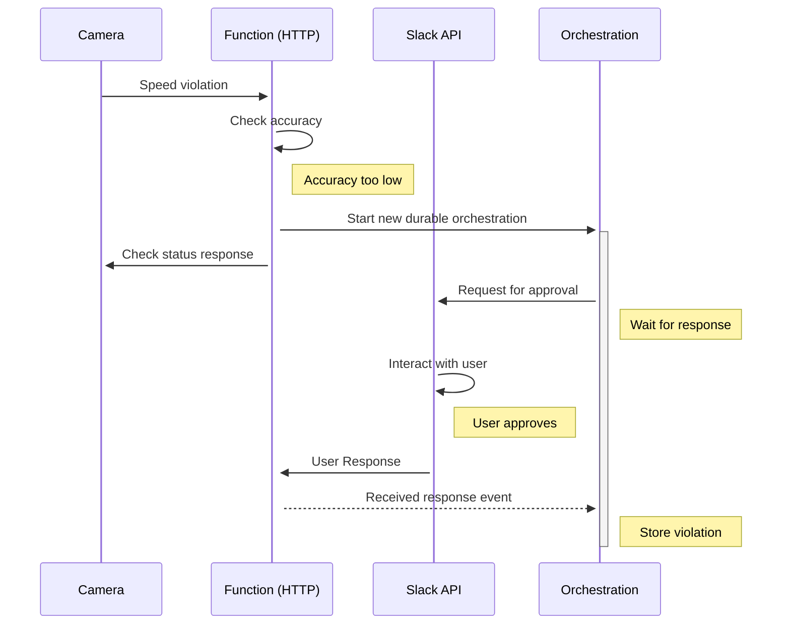

# Sequence Diagram

```mermaid
sequenceDiagram
  participant Camera
  participant Function (HTTP)
  participant Slack API
  participant Orchestration
  Camera->>+Function (HTTP): Speed violation
  Function (HTTP)->>+Function (HTTP): Check accuracy
  Note right of Function (HTTP): Accuracy too low
  Function (HTTP)->>+Orchestration: Start new durable orchestration
  activate Orchestration
  Function (HTTP)->>+Camera: Check status response
  Orchestration->>+Slack API: Request for approval
  Note right of Orchestration: Wait for response
  Slack API->>+Slack API: Interact with user
  Note right of Slack API: User approves
  Slack API->>+Function (HTTP): User Response
  Function (HTTP)-->>Orchestration: Received response event
  Note right of Orchestration: Store violation

  deactivate Orchestration
```
