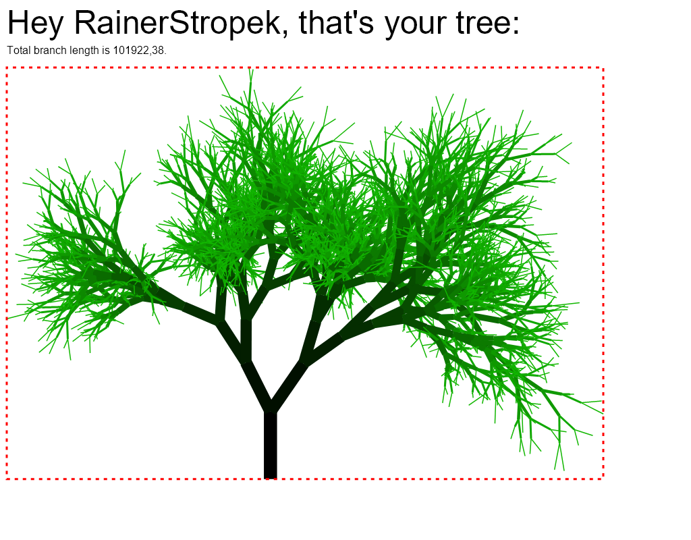

# Storyboard



## Getting Started

* Create new console app with .NET 6
* Add *appsettings.json*. We will need this settings in a moment.
  
  ```json
  {
    "maxLevel": 13, // Complexity of tree (beware of values > 13)
    "trunkLength": 100.0, // Length of trunk
    "boundingRect": 1 // 1 if bounding rectangle should be drawn, otherwise 0
  }
  ```

* Copy project settings from [*FunWithTrees.csproj*](FunWithTrees.csproj)
* Discuss project settings
* Add [*Usings.cs*](Usings.cs) with global usings
  * Discuss global usings

## Some C# 11 Features

* Add code for reading configuration file (region *Read configuration file*)
* Add error in *appsettings.json* to see result of raw string literal.
* Discuss new *IParseable* interface (generic math)
* Remove `return` from exception handling to demonstrate simplified null checking.

## String Interpolations and Linq Enhancements

* Add code for generating seeded random number generator (region *Generate hash based on user name*)
* Show generated IL Code for string interpolation with *dnSpy*
* Point out Linq enhancements
  * https://slides.com/rainerstropek/dotnet-6/fullscreen#/7
  * https://github.com/rstropek/Samples/blob/master/DotNet6/LinqEnhancements/Program.cs

## Record Structs

* Add code for lines and vectors (region *Line and Vector*)
* Discuss record structs
  * https://slides.com/rainerstropek/csharp-10/fullscreen#/2
  * https://github.com/rstropek/Samples/blob/master/DotNet6/RecordStruct/Program.cs

## Caller Argument Expressions

* Add code for allocating memory for tree on stack
  * Discuss stack allocation
  * `Span<Line> lines = stackalloc Line[numberOfLines]; // Note: Stack allocation of record struct`
* Add memory limiting mechanism (region *Allocate memory for tree*)
  * Discuss caller argument expression by enforcing exception
* Discuss newlines in complex interpolations

## Lambda Improvements and Record Struct Handling

* Add code for generating branch lines (region *Generate tree geometry*)
  * Without lines aggregation

## Create Skia Drawing Canvas

* Region *Create Skia drawing canvas*
  * We will use it later for demonstrating bounding rect usage
* Add header text (region *Draw header text*)
  * Discuss new list patterns and extended property pattern
  * Without total length
  * Point out interpolated string handling again
* Save PNG and open it (region *Save PNG and open it*)

## Record Struct Hash Code

* Add code for drawing branches (region *Draw branches*)
  * First without color caching
* Add color caching
  * Show generated `GetHashCode` in *dnSpy*

## Static Abstract Members in Interfaces

* Add preprocessor settings at beginning of file
* Region *Line aggregations*
  * Add `BoundsRect` without interface
    * Discuss `with` clause for record structs
  * Add `VectorLength` without interface
  * Add `ISupportAdding`, add it to previously added structs
  * Add `SumOfLines`
* Add aggregating lines to *Generate tree geometry* region
* Change `canvas.Translate` in *Create Skia drawing canvas*
* Add bounding rect (region *Draw bounding rectangle*)
* Add total length drawing to region *Draw header text*
  * Discuss interpolated string handling with *dnSpy*
