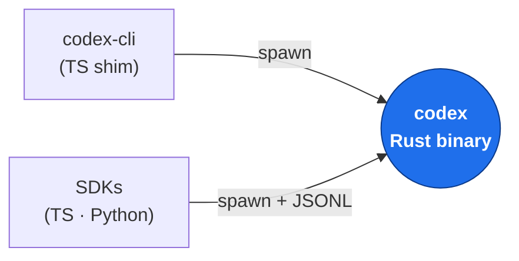
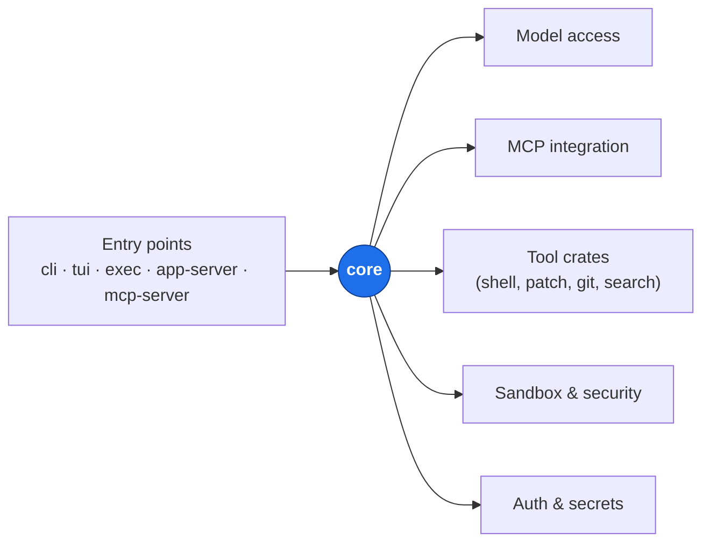
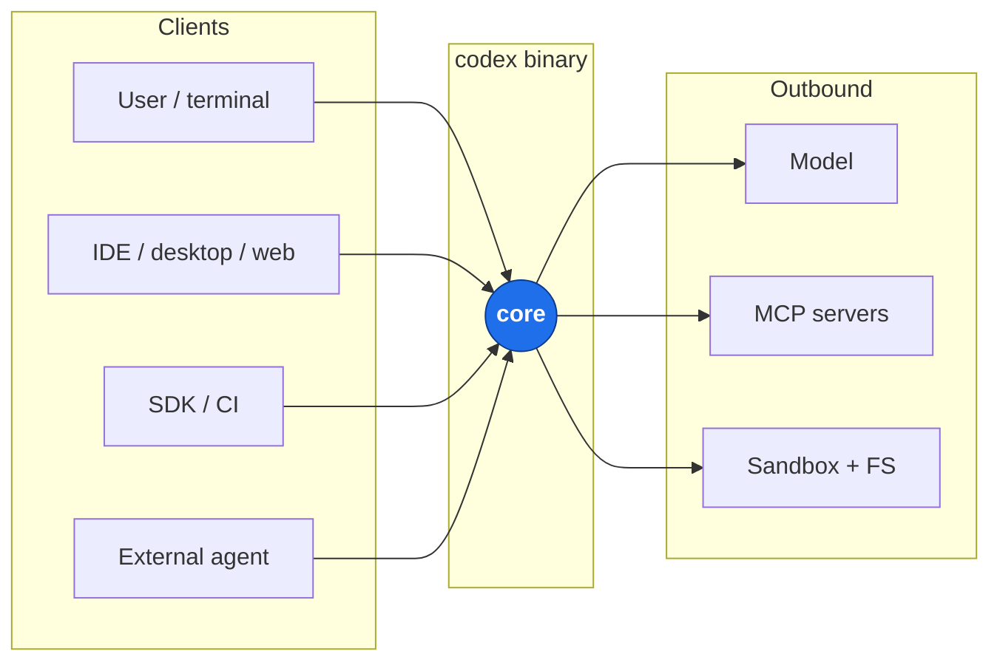
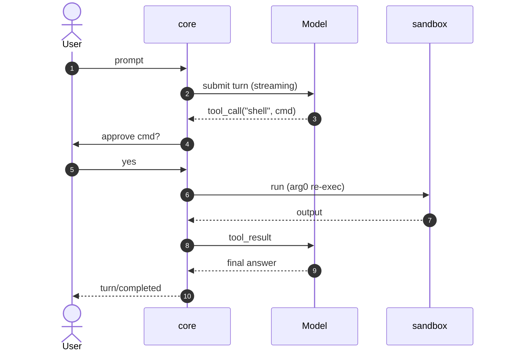
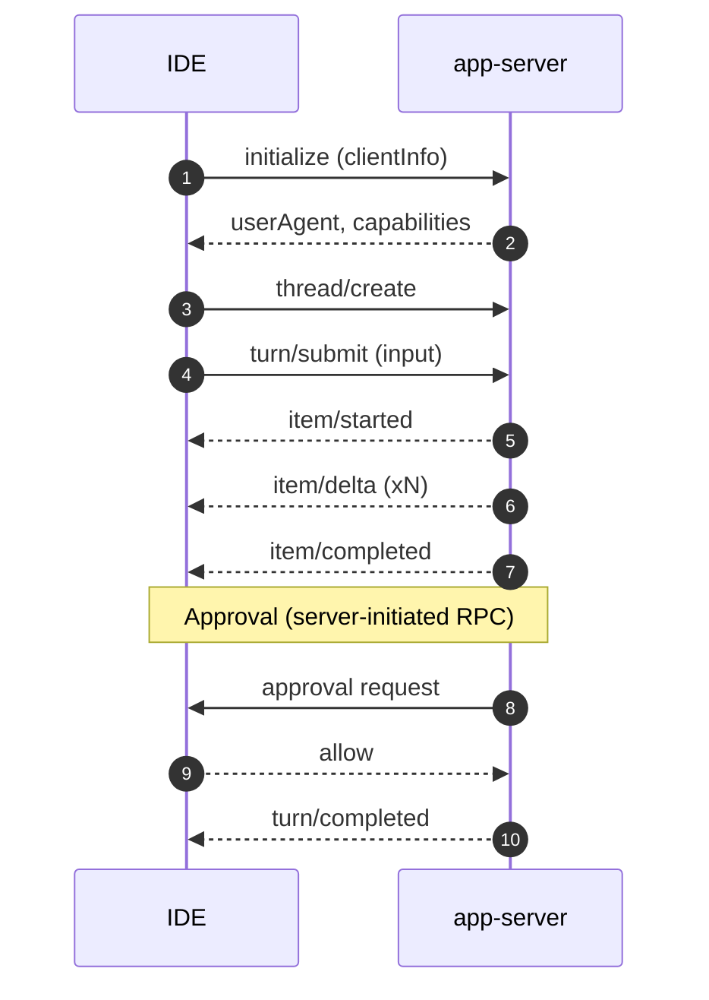
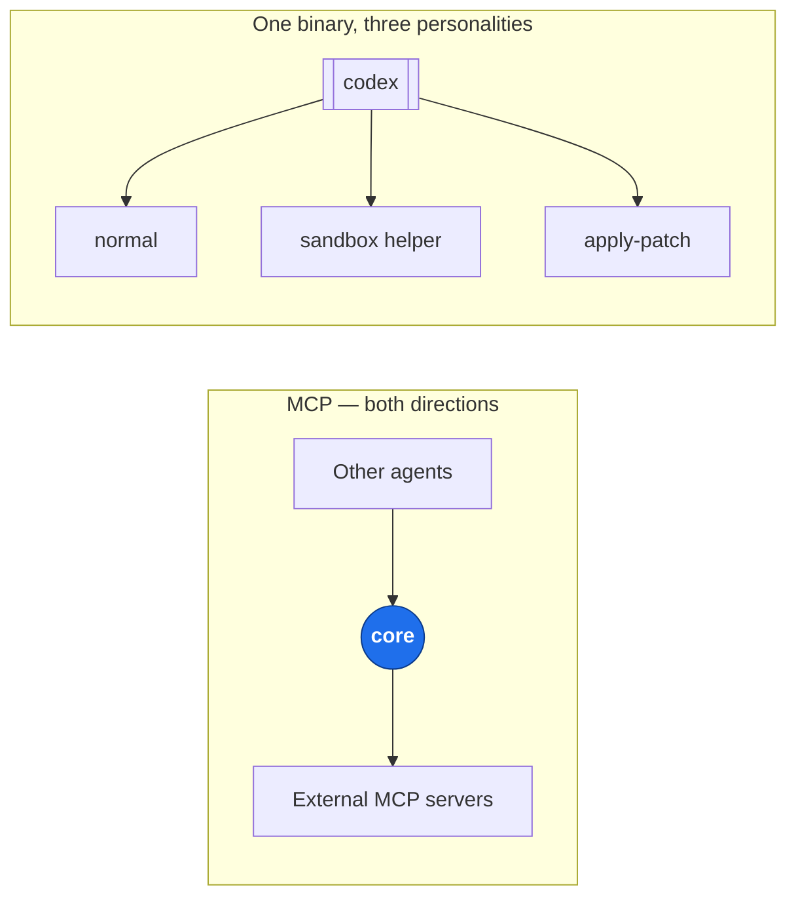
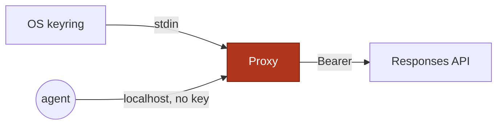
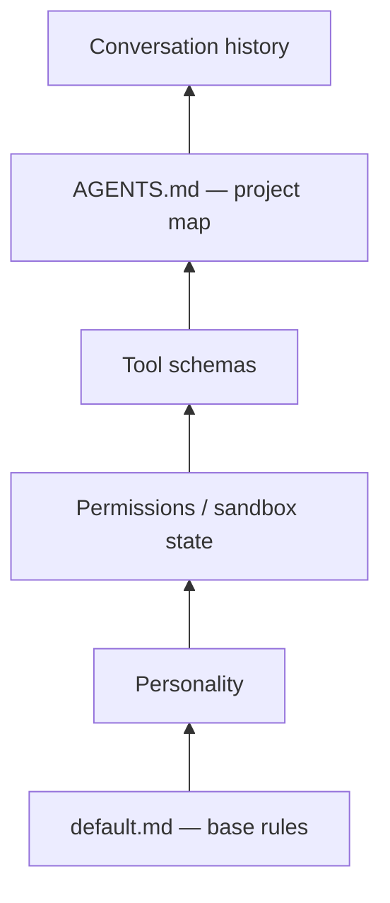
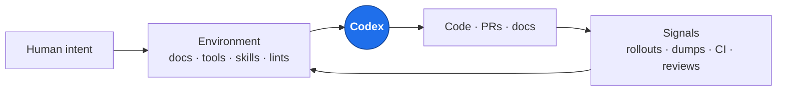
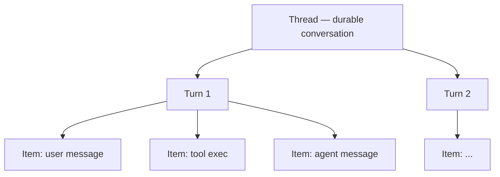

# Codex — Diagrams for the Presentation

All diagrams are Mermaid. Each one is **optimized for a projected slide** — few nodes, short labels, one idea per picture. Rich detail lives in the speaker notes, not on the slide.

Obsidian renders them natively; for slides, export per-block to PNG/SVG or run `npx @mermaid-js/mermaid-cli -i 02_diagrams.md -o diagrams.pdf`.

**Recommended order in the talk:** D1 → D3 → D2 → D6 → D4 → D5 → D8 → D9 → D10 → D7 (optional).

---

## D1 — One Product, Two Codebases

The TS CLI you `npm install` is a thin launcher. Everything substantive is Rust.

**Speaker notes**

- The TS CLI you get with `npm install -g @openai/codex` is tiny — on the order of 40 lines of real logic. Its whole job is to locate the correct prebuilt Rust binary for your OS/arch (macOS-arm64, linux-x64, …), spawn it as a child process, and forward stdio and signals. It does **not** contain any agent logic. If you read it, it will look anticlimactic — that's the point.
- The `codex` Rust binary is where everything lives: the agent loop, model clients, MCP, sandbox, tools, config, auth. Shipping one statically-linked Rust binary means one artifact to sign, notarize, cache, and security-review. The TS package is a convenience wrapper because developers expect to install CLIs via npm.
- The TypeScript and Python SDKs follow the same pattern: they **spawn the same Rust binary** as a subprocess and exchange newline-delimited JSON over stdio. They are not in-process bindings and there is no FFI. This matters because it means every client — TUI, IDE, SDK, CI script — drives the exact same agent, just over different transports.
- Build tooling the audience might notice in the repo: Cargo for Rust, pnpm for the TS workspace, Bazel for hermetic cross-platform builds (used by CI and release), and a `justfile` as the task runner. Day-to-day development is Cargo + pnpm; Bazel is there so a Mac dev and a Linux CI container produce byte-identical outputs.

---

## D2 — The Rust Workspace, at a Glance

~95 crates, but they fall into seven clusters. `core` is the hub; everything else is a focused module. Resist growing `core` — new features get a new crate.

**Speaker notes**

- **Why so many crates?** Rust compiles each crate in parallel and caches them independently. Splitting the workspace into ~95 focused crates instead of a few huge ones means faster incremental builds, clearer public APIs between modules, and fewer accidental dependencies. It also makes each piece independently testable and swappable — e.g. `ollama` and `lmstudio` are separate crates that both implement the same `model-provider` trait.
- **What each cluster does:**
  - **Entry points** are small `main()` wrappers: `cli` (the default command router), `tui` (ratatui-based interactive UI), `exec` (one-shot scriptable runs for CI), `app-server` (JSONL service for IDEs/desktop/web), `mcp-server` (exposes Codex as an MCP tool to other agents).
  - **Agent engine** is the heart: `core` runs the turn loop, `protocol` defines the wire types, `state` and `thread-store` persist conversations, plus `tools`, `skills`, `hooks`.
  - **Model access** wraps the different backends (OpenAI Responses API, ChatGPT OAuth, Ollama, LM Studio) behind a common interface.
  - **MCP integration** handles both sides — calling external MCP servers and being one.
  - **Sandbox & security** — the `execpolicy` rule engine, per-OS sandbox crates (`linux-sandbox`, `windows-sandbox-rs`, Seatbelt on macOS via `core`), `process-hardening`, `network-proxy`.
  - **Tool crates** are what the agent actually invokes: `apply-patch` for diffs, `file-search` for fuzzy find, `git-utils`, `shell-command`.
  - **Auth & secrets** — OAuth/API-key flows in `login`, OS keyring storage in `keyring-store`.
- **The cultural rule:** resist growing `core`. New features get a new crate. You can see this discipline in the repo — there's a dedicated crate for *output truncation*, for *absolute paths*, for *fuzzy matching*. Each is tiny but has a clean boundary.
- **A tell for how seriously they version internal APIs:** `execpolicy-legacy` lives next to `execpolicy`. When they changed the rule engine, they kept the old one around rather than breaking older configs — the same discipline they apply to the public App Server protocol.

---

## D3 — One Engine, Many Surfaces

The money slide. Every user, IDE, script, and external agent ends up in the same `core`.

**Speaker notes**

- **The core claim:** "four doors into the same room." Every surface — human in a terminal, IDE extension, CI script, another AI agent — runs the *same* agent loop. The transports differ, but they all end up calling into the `core` crate.
  - TUI: stdin/stdout as a local UI, `core` embedded in the same process today.
  - IDE / desktop / web: JSONL over stdio using the **App Server** "JSON-RPC lite" protocol (more detail on D5). Codex Web runs the same binary *inside a per-session container* and tunnels stdio over a persistent network connection to the browser backend.
  - SDK / CI: spawns `codex exec`, which emits newline-delimited JSON events to stdout. Scripts pipe them through `jq` or parse directly.
  - External agent: talks MCP to `codex mcp-server`, which exposes Codex's capabilities as MCP tools.
- **Why this matters:** the engine is written once. Fix a bug in the turn loop, every surface benefits. Add a new tool, every surface can use it. Without this discipline you end up with four divergent agents drifting over time.
- **OpenAI's Feb 2026 stance** (["Unlocking the Codex harness"](https://openai.com/index/unlocking-the-codex-harness/)): the **App Server** is the first-class integration going forward — if you're building a new client, build an App Server client. MCP, `codex exec`, and the Codex SDK are still supported but narrower. MCP can't cleanly represent rich IDE semantics like streaming diffs or mid-turn approvals; `codex exec` is scriptable but one-shot; the TS SDK is convenient but smaller surface.
- **Not-yet-done:** the TUI still runs `core` in the same process today (via a sync Rust client called `app-server-client`). A [refactor (PR #10192)](https://github.com/openai/codex/pull/10192) makes the TUI spawn `app-server` as a child and talk JSON-RPC to it, the same way VS Code does. When that lands, the TUI gains the ability to point at a *remote* Codex — your laptop runs the UI, a beefy cloud machine runs the agent.
- **Outbound edges:** the Responses API is streamed via SSE (token-by-token), MCP servers are local subprocesses talking stdio, and any risky shell command goes through an arg0 re-exec into a sandboxed helper (detail on D4 and D6).

---

## D4 — A Turn with a Tool Call + Approval

What the audience sees live in the TUI, reduced to the gates that matter.

**Speaker notes**

- **The overall shape of a turn:** user types a prompt, `core` sends it to the model over a streaming HTTP call, the model streams back either text (which becomes the agent's reply) or a tool call (e.g. "run `pnpm test`"). If it's a tool call and the policy says so, `core` asks the user for approval, runs the command in a sandbox, feeds the output back to the model, and the model continues until it decides the turn is done.
- **Step 3 — tool calls are structured.** The model doesn't output "please run pnpm test" as text; it emits a typed `tool_call` (name + JSON arguments) via the Responses API. Codex has a small set of built-in tools (`shell`, `apply_patch`, `file_search`, …) plus anything user-configured MCP servers expose.
- **Steps 4–5 — the approval gate.** This is a real RPC, not a UI modal with local logic. `core` asks the *client* (TUI, IDE, whatever) for approval and pauses the turn. Whoever is attached answers. Same gate applies everywhere, which is why the IDE approval dialog behaves identically to the TUI's "y/n?" prompt. The policy engine (`execpolicy` crate) decides what needs approval based on the sandbox mode (`read-only`, `workspace-write`, `danger-full-access`) and the specific command pattern.
- **Step 6 — the sandbox re-exec.** `core` does **not** fork+exec the command directly. Instead it re-executes *its own binary* with `argv[0]` set to `codex-linux-sandbox` (or the OS equivalent). The binary detects this at startup, switches into sandbox-helper mode, sets up OS-level isolation (Landlock + bubblewrap on Linux, Seatbelt profile on macOS, Windows sandbox on Windows), and only then runs the command. This guarantees the agent process itself can't accidentally skip the sandbox — the isolation lives in a different process with a reduced-privilege profile.
- **Streaming throughout.** Model tokens arrive via Server-Sent Events and are relayed to the UI as `item/delta` events. Command output also streams live. The UI renders incrementally — the user sees tokens appear, sees the command running, sees stdout come back in real time. The agent never waits on a complete response before showing something.
- **What's not shown:** the context that goes *into* the model call — the base system prompt, the `AGENTS.md`, tool schemas, and conversation history. That's covered in D8 and in report `03`.

---

## D5 — IDE via App Server (Protocol Shape)

The Thread/Turn/Item vocabulary. This is what a new client integration sees on the wire.

**Speaker notes**

- **This diagram is the client integrator's view.** D4 was what happens inside a turn; D5 is what a new IDE plugin or app sees on the wire when it talks to Codex.
- **`initialize` is mandatory and comes first.** The client sends `{method: "initialize", params: {clientInfo: {name, title, version}}}`. The server replies with a `userAgent` string like `codex_vscode/0.94.0 (Mac OS 26.2.0; arm64) …` plus a capability advertisement. This is how both sides negotiate protocol version and feature flags before the real work starts. If the client skips this, every subsequent call fails.
- **`thread/create` and `turn/submit`** — a `thread` is a durable conversation (persisted to disk, resumable after a crash or tab close). A `turn` is one unit of agent work, kicked off by a user input. One thread can have many turns; one turn unfolds into many items.
- **Item events** — every time the agent produces something observable (a chunk of a reply, a tool call it's about to make, a diff, an approval request), the server emits three notifications: `item/started` (new thing starting), `item/*/delta` (streaming content for message-like items), `item/completed` (with the final payload). The client renders incrementally on `started`, updates on each `delta`, and finalizes on `completed`. This is how VS Code shows a streaming agent message instead of waiting for the whole thing.
- **Approvals are server-initiated.** Most JSON-RPC setups are one-way: client asks, server answers. Here, the server can call back *to the client* mid-turn ("the agent wants to run `rm -rf node_modules`, allow?"). The turn pauses until the client answers. This is why the protocol has to be bidirectional and why plain HTTP request/response wouldn't work.
- **Transport detail:** "JSON-RPC lite" means the standard request/response/notification shape but **without** the `"jsonrpc": "2.0"` envelope, framed as one JSON object per line (JSONL) over stdio. For Codex Web, "stdio" is tunneled over a persistent network connection to a container — the App Server sees regular stdin/stdout, the network layer is invisible to it.
- **Don't hand-write a client.** The Rust protocol types are the source of truth. Run `codex app-server generate-ts` for a TypeScript `.d.ts`, or `codex app-server generate-json-schema` for a JSON Schema bundle you can feed into any code generator. Clients already exist in the wild for Go, Python, TypeScript, Swift, and Kotlin — the OpenAI team mentions that Codex itself is usually capable of generating a first-draft integration given the schema and docs.
- **Debug helper:** `codex debug app-server send-message-v2 "run tests and summarize failures"` drives a full turn end-to-end and prints every message — great for seeing the protocol by example.

---

## D6 — Two Non-Obvious Tricks

Left: MCP is bidirectional. Right: one binary, three personalities.

**Speaker notes**

- **Left side — MCP is bidirectional.** The [Model Context Protocol](https://modelcontextprotocol.io) is an open standard for exposing tools/resources to LLMs, originally introduced by Anthropic. Codex speaks it in **both directions**:
  - *As a client:* `core` can call any external MCP server configured by the user (filesystem, GitHub, Slack, a custom tool). The agent sees those tools as if they were built-in. This is how harness engineers extend Codex without modifying it — drop in a new MCP server, it's a new capability.
  - *As a server:* the `codex mcp-server` binary exposes Codex's capabilities to other agent frameworks (OpenAI Agents SDK, Claude Desktop, LangChain, etc.). That outer agent treats Codex as a *single MCP tool* it can call. This is how you put Codex inside a multi-agent system.
- **MCP vs App Server — don't conflate them.** MCP is a narrower, standardized "call this tool" protocol designed for tool portability across model vendors. The App Server is Codex's richer first-party protocol for *clients that want the full harness* (streaming items, approvals, threads, diffs). An MCP tool call is "name + JSON args → result"; an App Server session is a whole conversation with lifecycle.
- **Right side — arg0 dispatch.** On Unix, `argv[0]` is the name the binary was invoked as. Codex inspects it at startup and dispatches to one of three modes:
  - `codex` → normal mode (TUI, app-server, exec, …).
  - `codex-linux-sandbox` → sandbox helper: sets up Landlock + bubblewrap, then runs the command.
  - `apply-patch` → diff applier: reads a patch on stdin and applies it.
- **Why one binary?** Ops wins: one file to ship, sign, notarize, update, and security-review. If it were three binaries you'd have version-skew risk (core compiled against one patch helper, installed alongside a different one). Re-execing also gives the child a clean process image with its own environment and file descriptors — no leakage from the parent. The cost is basically nothing — it's just an extra `execve`.
- **Security angle:** the sandbox helper is process-separated from `core` *on purpose*. If there were a bug in `core` that let the agent skip the isolation, the sandbox process wouldn't be affected — it enforces Landlock on itself at startup regardless of what the parent did. Defense in depth.

---

## D7 — Credential Isolation *(optional bonus)*

The agent process never holds the API key. Belt-and-braces engineering.

**Speaker notes**

- **The problem this solves.** The Codex agent process is large, executes model-suggested shell commands, and loads MCP servers written by who-knows-who. Any of those could try to read your API key from memory, environment variables, or disk. If the agent process never *has* the key, that entire attack surface disappears.
- **How the isolation works.**
  - A privileged user (root or sudo) starts `codex-responses-api-proxy` and feeds the API key **only via stdin** — never via environment variable or config file. The proxy immediately `mlock(2)`s the memory holding the key so it can't be swapped to disk, and zeroes out the stack buffer it was read into.
  - The agent runs as an unprivileged user and talks to the proxy over plain HTTP on localhost. The agent's config points at `http://127.0.0.1:<port>/v1` — there's no key in that config.
  - The proxy is a hard allowlist: it only forwards `POST /v1/responses`. Every other request is rejected with `403`. So even if the agent or an MCP tool wanted to, it couldn't use the proxy to hit arbitrary endpoints.
  - The proxy injects the `Authorization: Bearer <key>` header just before forwarding to `api.openai.com` (or an Azure deployment). Response is streamed back to the agent transparently.
- **Privilege separation in OS terms.** Think `sudo`-style: one process (proxy, root) holds the secret, another (agent, your user) does the work. A compromise in the agent doesn't grant access to the key. The proxy also applies standard process hardening (the `codex-process-hardening` crate) — no core dumps, restricted signals, etc.
- **Bonus observability — `--dump-dir`.** Point the proxy at a directory and it writes **every** accepted request/response to disk as pretty JSON, paired by sequence number: `000001-*-request.json` and `000001-*-response.json`. Authorization headers and cookies are redacted. This is the mechanism that makes the "show me the verbatim prompt" workshop in report `04` possible — you see exactly what the model sees, turn by turn, including the full composed system prompt, the conversation history, and the tool schemas.
- **Who should care:** security-minded audiences, regulated industries, anyone worried about supply-chain risk in MCP servers. If the audience is all individual developers on personal laptops, this slide is skippable.

---

## D8 — Prompt Composition (Layered)

Codex's system prompt isn't one file — it's a stack. Same progressive-disclosure pattern the Harness Engineering post (report `06`) recommends for *your* repo.

**Speaker notes**

- **The big idea:** Codex's system prompt is not one giant file. It's a stack of independently-edited layers, composed fresh on each turn. This is why the codebase has many small `.md` prompt files (embedded into the Rust binary via `include_str!` — see report `03`) rather than a single mega-prompt.
- **Layer by layer, bottom to top:**
  - **`default.md`** — base rules, ~276 lines. Covers honesty, how to reason, when to ask for clarification, how to handle errors, tone defaults, safety. This is what makes "Codex" feel like Codex regardless of the project.
  - **Personality** — short files selected based on config: "friendly", "pragmatic", etc. These nudge tone without changing behavior.
  - **Permissions** — injected dynamically based on the current sandbox mode (`read-only` / `workspace-write` / `danger-full-access`) and approval policy. If the agent is in read-only mode, the prompt tells it so — it doesn't try to write files and fail.
  - **Tool schemas** — the list of available tools (shell, apply_patch, MCP tools, …) arrives via the *structured* tool-calling channel of the Responses API, not as prose in the prompt. The model sees a JSON schema, not a paragraph of English.
  - **`AGENTS.md`** — the *project-specific* map, loaded from the repo. OpenAI's own internal product keeps this ~100 lines. It points the agent at `docs/`, `ARCHITECTURE.md`, and whatever project-local rules exist. It is **not** the encyclopedia; it is the table of contents.
  - **Conversation history** — everything that has happened in this thread so far, most recent at the end. Grows every turn until compaction kicks in.
- **Why the layering matters:** each layer is edited independently, versioned independently, and loaded only when relevant. The base rules don't contain project knowledge; the project map doesn't re-explain how to reason. Nothing is crowded out.
- **Tie to Harness Engineering (report `06`):** Lopopolo's "give Codex a map, not a 1,000-page manual" is this exact pattern applied at the *project* scope. Codex already does it at the *agent* scope. The presentation lands this idea by showing: "Codex applies its own advice to itself."
- **Compaction as GC:** when the conversation history (top layer) approaches the context window, a separate summarizer model reads it, produces a structured summary, and the "reader" continues from that summary plus the unchanged lower layers. Report `03` §4 has the actual prompts used. Same principle as a generational GC — old history is compacted, recent items stay verbatim.

---

## D9 — The Harness Engineering Feedback Loop

Why the previous 8 diagrams matter. The harness engineer's job is not to write code; it's to keep this loop tight.

**Speaker notes**

- **This slide is the thesis of report `06`.** After you've walked through the architecture, zoom out: why did they design Codex this way? Because the interesting engineering work has moved from writing code to designing the environment the agent operates in. This diagram is that loop.
- **The loop, stage by stage:**
  - **Intent** — a human specifies what they want. A prompt, a ticket, a PR comment. This is the only point humans write creative content; everything else flows from here.
  - **Environment** — what the agent can see and touch: repo docs (`AGENTS.md`, `docs/`), available tools (shell, apply_patch, MCP servers), installed skills, CI, linters, test suites. The harness engineer's job.
  - **Agent** — Codex reads the environment plus the intent, produces work.
  - **Artifacts** — code, PRs, diffs, docs, dashboards. The visible output.
  - **Signals** — evidence of how the work went: CI pass/fail, lint errors, test results, human reviews, agent-to-agent reviews, rollout logs, `--dump-dir` JSON. Everything that tells you whether the agent is doing the right thing.
  - **Back to environment** — each signal feeds improvement of the environment itself: a new lint rule, a clearer `AGENTS.md` section, a new skill, a better tool error message.
- **The key inversion:** when the agent fails, the knee-jerk is "try a better prompt." The harness-engineering move is "what's missing in the environment?" Add the missing doc, skill, linter, or tool — then ask the agent to write the fix using the improved environment. The improvement compounds; the prompt-tuning doesn't.
- **"Error messages are prompts."** This is the single most useful idea in Lopopolo's post. Every lint error, every compile error, every test failure the agent sees is *literally input to the next turn* — it becomes part of the conversation history. So write those messages as instructions to a future agent: "This pattern is disallowed because X. Use Y instead." That's why Codex's own `apply_patch` errors (report `03` §3) read like coaching, not just diagnostics.
- **Why Codex is built for this loop.** The architecture you've seen directly supports it:
  - The **App Server's item stream** (D5) gives you every intermediate step to observe and grade.
  - The **rollout files** persist every turn so signals can be mined after the fact.
  - The **`--dump-dir`** capability (D7) shows exactly what the agent saw, turn by turn.
  - The **skill format** (report `05`) is the distribution mechanism for environment improvements — write a rule once, install it everywhere.
  - The **bidirectional MCP** lets you add new capabilities to the environment without forking Codex.
- **Takeaway for the audience:** if you remember nothing else, remember that your team's long-term velocity comes from keeping this loop tight — not from writing the best one-off prompt.

---

## D10 — Thread / Turn / Item (the Primitives)

The three nouns the App Server is built around. Know these cold before looking at any sample code.

**Speaker notes**

- **Why introduce vocabulary on a slide?** Because the App Server protocol is built around three nouns. If the audience internalizes them early, every code sample and sequence diagram afterwards clicks immediately. Think of it like understanding `Stream`/`Request`/`Response` before reading any HTTP code.
- **Thread — the durable container.**
  - Created with `thread/create`, identified by a `threadId`.
  - Persisted to disk (in `~/.codex/sessions/` as rollout JSONL files, see report `04`).
  - Can be **resumed** after the client dies — the Codex Web app relies on this: close a browser tab, reopen it, the thread is still there.
  - Can be **forked** — start a new branch from a past point in the conversation to try a different approach.
  - Can be **archived** when done.
- **Turn — one unit of agent work.**
  - Kicked off by `turn/submit` with user input (a prompt, a review comment, etc.).
  - Ends with `turn/completed` when the agent has produced everything it's going to produce for that input.
  - A single turn can be huge — the Lopopolo post mentions single turns that run *six hours* (often overnight) before completing, while the agent drives the app, reads logs, tries fixes, and iterates.
  - A thread contains many turns in sequence.
- **Item — the atomic typed I/O unit.**
  - Every observable thing the agent does is an item with a type and a lifecycle.
  - **Types include:** user message, agent message (text reply), tool execution (e.g. a shell command), approval request, diff/patch, …
  - **Lifecycle:** `item/started` (a new item is beginning), optional `item/*/delta` (streaming content, for message-like items), `item/completed` (final payload, immutable after this).
  - The client renders on `started` (e.g. "Codex is running `pnpm test` …"), updates on each `delta`, and finalizes on `completed` (showing the output).
- **Why this shape?** The agent loop is *not* simple request/response. One user prompt can unfold into many actions (read files, run commands, write code, ask for approval, reply). The protocol has to represent that structurally so any UI can render it faithfully — whether it's a terminal, a VS Code panel, a web app, or something the audience hasn't thought of yet.
- **Practical use of this slide:** whenever you show JSON from a real rollout or `--dump-dir` output later in the talk, point back here. The audience will recognize `item.started`, `item.completed`, `turn/completed` instead of being confused by them.

---

## Verification checklist

- [ ] Open this file in Obsidian; every fenced `mermaid` block renders without a parse error.
- [ ] Each diagram has ≤ ~10 nodes — if not, simplify further.
- [ ] For slide export: `npx @mermaid-js/mermaid-cli -i 02_diagrams.md -o diagrams.pdf` (or right-click → export per block in Obsidian).
