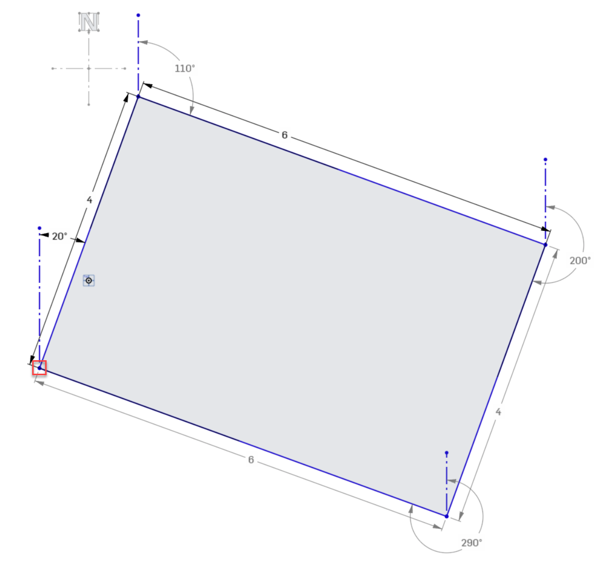
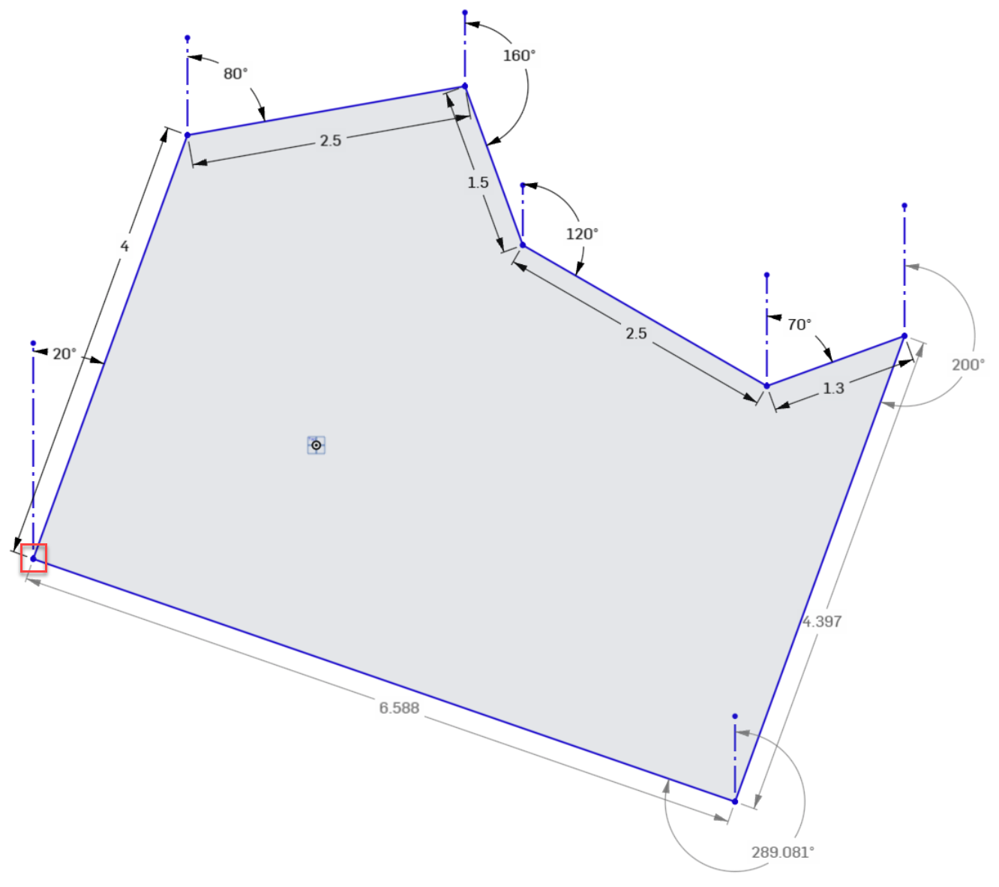

# Work Item: Area Calculation

## Task Description

You work in an engineering office for surveying technology and have been tasked with developing software for surveying work. We have a surveying device that can measure the distance from one point to another and, in addition to the distance, also measures the angle in degrees (relative to magnetic north). It ignores earth curvature, slopes, inclinations, and the surveying of curves.

## Examples

### Simple Survey

Here is an example of a survey of a rectangular plot:

- The survey started at the point marked in red.
- The first measured side of the plot is 4m long and has an angle of 20° relative to magnetic north.
- The second side is 6m long with an angle of 110°.
- The third side is 4m long with an angle of 200°.
- The fourth side is not measured anymore but is derived from the distance from the last to the first point. We can calculate that the fourth side is 6m long with an angle of 290°.
- The area of the plot is 24m².

### Complex Survey

Here is a second, more complex example (survey starts again at the point marked in red):

|  Length | Angle |
| ------: | ----: |
|      4m |   20° |
|    2.5m |   80° |
|    1.5m |  160° |
|    2.5m |  120° |
|    1.3m |   70° |
|  4.397m |  200° |

The last side is derived from the distance from the last to the first point (6.588m, 289.081°). The area of this plot is 27.8m².

The following constraints can be assumed:

* The plot sides are measured and entered clockwise.
* The plot sides are always straight.
* The sides do not intersect.

## Quality Criteria

* Define a type for holding the survey data (points with lengths and angles).
* Implement a function that turns these points into x/y coordinates relative to the starting point.
* Implement a function that calculates the area of the plot based on the coordinates.
