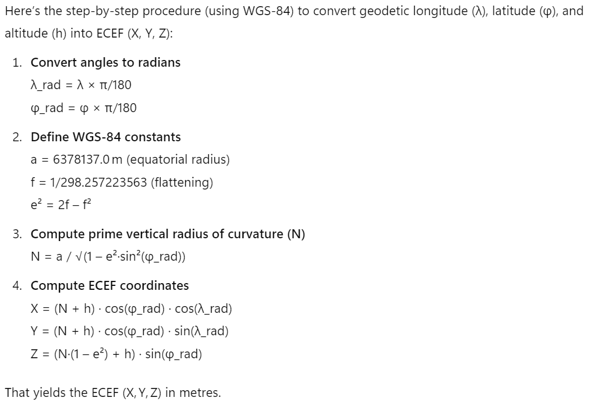

# Orbital Watch – Space Debris Alert

## Introduction

Welcome aboard the _Upper Austrian Space Exploration Agency_ (UASEA), pioneers at the forefront of space research and orbital safety monitoring. At UASEA, our primary mission is the safe operation and management of satellites orbiting Earth, critical to communication, navigation, and global security.

Today, you join the elite _Orbital Surveillance Team_ at UASEA's control center in Pasching, responsible for ensuring the safety and integrity of our satellites circling high above Earth. A recent rise in space debris—from abandoned rocket parts to fragments from satellite collisions—poses a growing risk. Our state-of-the-art radar systems continually track debris objects and satellites, providing positions in both [GPS coordinates](https://en.wikipedia.org/wiki/Geographic_coordinate_system) (latitude, longitude, altitude) and [_Earth-Centered Earth-Fixed_](https://en.wikipedia.org/wiki/Earth-centered,_Earth-fixed_coordinate_system) (ECEF) coordinates (X, Y, Z).

As an _Orbital Surveillance Officer_, your primary task is to monitor and analyze space debris data. You will be provided with satellite positions along with recently detected space debris coordinates. Through a series of coding challenges, you'll transform and compare these coordinates to identify and alert the team about potential collision risks. By completing these tasks, you will ensure UASEA's satellites remain operational and avoid catastrophic collisions, maintaining safe, clear skies for future exploration and research.

Good luck, officers — our satellites depend on your expertise!

## Challenge One: The Coordinate Conversion Console

Disaster has struck — one of our satellites collided with a piece of space debris. This incident is a stark reminder of how crucial continuous monitoring is. To prevent future collisions, your _Orbital Surveillance Team_ has decided to automate the detection of nearby debris.

However, there's a complication. Debris and satellite data come from different systems. Space debris data is given in GPS coordinates (latitude, longitude) and altitude above [_Mean Sea Level_](https://www.esri.com/about/newsroom/arcuser/mean-sea-level-gps-geoid?rsource=https%3A%2F%2Fwww.esri.com%2Fnews%2Farcuser%2F0703%2Fgeoid1of3.html) (MSL), while satellite data uses ECEF coordinates (X, Y, Z from Earth’s center).

Your first mission is to convert GPS degree coordinates (e.g., `11°37'44N`) to decimal format (e.g., `11.628889`) using the formula: `degrees + minutes/60 + seconds/3600`. Don’t forget to apply the correct sign: negative for the Southern and Western hemispheres. Round your results to six decimal places.

Here’s a sample dataset for testing:

| Degree Coordinates | Decimal Coordinates |
| ------------------ | ------------------: |
| 11°37'44N          |           11.628889 |
| 145°50'21W         |         -145.839167 |
| 12°30'00S          |          -12.500000 |
| 74°00'00W          |          -74.000000 |
| 120°45'30E         |          120.758333 |
| 00°00'01N          |            0.000278 |

Once your conversion routine is ready, apply it to the current debris data (_space_debris_positions.csv_):

1. Read the [*space_debris_positions.csv*](./space_debris_positions.csv) CSV file.
2. Convert Latitude and Longitude to decimal coordinates.
3. Add all decimal latitude and longitude values separately.
4. Multiply the two sums.

If the result is **2436297.459044**, your conversion is spot on.

## Challenge Two: From Earth to Space

With GPS-to-decimal conversions under your belt, you're ready to tackle the next challenge. But there’s one more step before launching the alert system. Satellite positions are provided in _Earth-Centered Earth-Fixed_ (ECEF) format — a 3D Cartesian system based on Earth's center of mass, not on geographic coordinates.

To match the debris and satellite positions, you need to convert GPS coordinates to ECEF. Fortunately, a mathematically gifted friend has shared a handy reference to guide your conversion:

Use this to write a conversion routine. Round all X, Y, and Z values to two decimal places.

You can verify your implementation using the following test data:

| Input (Latitude, Longitude, Altitude) | Output (X, Y, Z)                     |
| ------------------------------------- | ------------------------------------ |
| 11.628889, -145.839167, 1795.59       | -6625344.32, -4495961.62, 1639159.98 |
| 90°3'28N, 143°42'18W, 1245.93         | 6214.0, 4563.8, 7602678.43           |

Once your converter is working:

1. Read the [*space_debris_positions.csv*](./space_debris_positions.csv) file.
2. Convert latitude and longitude to decimal format.
3. Convert latitude, longitude, and altitude to ECEF coordinates.
4. Calculate the total sum of all X, Y, and Z values in kilometers.

If the result is **-359776.16973** you've nailed it.

## Challenge Three: Collision Risk Alert

You've conquered the coordinate systems — now it's time for the real mission: detecting threats.

1. Read both the [*space_debris_positions.csv*](./space_debris_positions.csv) and [*satellite_positions.csv*](./satellite_positions.csv) files.
2. Convert the space debris coordinates to ECEF.
3. Identify all satellites with at least one debris fragment within 1 km (use [Euclidean distance](https://en.wikipedia.org/wiki/Euclidean_distance)).
4. For each satellite-debris pair within range, calculate the distance in meters and sum them all.

If you detect three satellites each with one dangerously close debris and your total distance equals **1500 m**, mission accomplished.

## Bonus Challenge: Speed up the Alert System

Still craving a challenge? Your current alert system works—but it’s not fast enough.

To boost performance, research _k-dimensional trees_ (k-d trees) and their ability to speed up nearest-neighbor searches. Implement a k-d tree-based approach and compare it to the brute-force method.

Consider calling in an AI assistant for help—it might just make your solution out of this world.

## Need Help

* [Sample solutions for conversion functions](./converter.py)
* [Sample solutions for challenge 1](./01_process_debris.py)
* [Sample solutions for challenge 2](./02_to_ecef.py)
* [Sample solutions for challenge 3](./03_find_satelites_near_debris.py)
* [Sample solutions for bonus challenge](./04_kd_tree.py)
